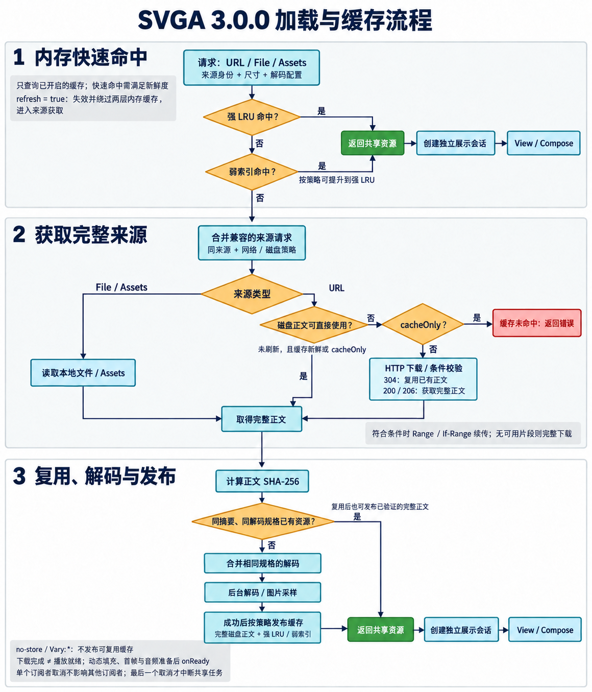

# 3.0.0 重大更新

- 模块化重构：拆分核心、加载器、Coil 3 和 Compose 模块，保留旧 API。
- 统一加载与缓存：支持 URL、File、Assets，共享资源、合并重复请求，支持取消和预加载。
- 新增 View 快捷加载和原生 Compose 组件，支持动态文字、图片替换及图层点击。
- 完善播放控制：支持暂停、恢复、进度跳转、倍速和倒放，优化不可见时的播放与资源释放。
- 优化 Bitmap 内存：按实际显示尺寸解码，可选 `RGB_565`（保留图片透明度）和跳过未使用、全程透明的图片，支持全局配置及单次覆盖。
- 增加下载进度与断点续传：共享下载的订阅者独立接收进度，符合条件的中断片段可在下次请求时续传。
- 增加强引用 LRU 与弱引用资源索引的独立开关，缓存淘汰或清理不会回收其他播放实例仍在使用的基础 Bitmap。
- 优化列表重复绑定：同一 View 的相同请求保留播放进度；支持静态首帧展示，以及单次播放时可选的按需图片解码和 `inBitmap` 复用。

3.0.0 使用 JitPack 远程依赖，以下以发布 Tag `3.0.0-beta1` 为例，版本号需与实际 Git Tag 完全一致。以下示例使用 3.0.0 的统一加载链路；旧 `SVGAParser` API 仍保留。完整说明见 [加载与 Compose 接入文档](./README-loading.md)。

## JitPack 远程接入

| 模块 | JitPack artifactId | 使用场景 |
| --- | --- | --- |
| `library` | `svga-core` | 核心渲染、播放控制及旧 API |
| `svga-loader` | `svga-loader` | 下载、缓存、取消和预加载 |
| `svga-coil3` | `svga-coil3` | View 快捷加载、Coil 3 动态图片填充 |
| `svga-compose` | `svga-compose` | 原生 Compose 组件和状态管理 |

最低支持 Android 21，Java 字节码目标为 17；使用 Compose 模块时需启用宿主的 Compose 编译插件。在宿主项目中加入 JitPack 仓库：

```kotlin
// settings.gradle.kts
dependencyResolutionManagement {
    repositories {
        google()
        mavenCentral()
        maven { url = uri("https://jitpack.io") }
    }
}
```

```kotlin
// app/build.gradle.kts，一次引入全部模块
dependencies {
    implementation("com.github.qqnp1100:SVGAPlayer-Android:3.0.0-beta1")
}
```

上述仓库坐标是聚合依赖，会引入全部已发布模块，包括 Compose。也可按照 [JitPack 多模块规则](https://docs.jitpack.io/building/#multi-module-projects) 按需选择模块，与聚合依赖二选一：

```kotlin
dependencies {
    // 仅使用 View：不会引入 Compose
    implementation("com.github.qqnp1100.SVGAPlayer-Android:svga-coil3:3.0.0-beta1")
    // Compose 项目改用以下依赖
    // implementation("com.github.qqnp1100.SVGAPlayer-Android:svga-compose:3.0.0-beta1")
}
```

各模块会自动引入所需下层模块。JitPack 构建并发布对应 Tag 后即可远程解析；如果 Tag 带 `v` 前缀，依赖版本也需包含该前缀。加载网络资源需在宿主 Manifest 声明 `android.permission.INTERNET`。

## 使用示例

### View 加载与播放

在布局中添加 View：

```xml
<com.opensource.svgaplayer.SVGAImageView
    android:id="@+id/svgaView"
    android:layout_width="200dp"
    android:layout_height="200dp" />
```

下面代码在 Activity 的 `setContentView` 之后、主线程执行；Fragment 中改用布局根 View 的 `findViewById`。示例 URL 和图层 key 请替换为业务素材实际值：

```kotlin
val svgaView = findViewById<SVGAImageView>(R.id.svgaView)
val handle = svgaView.loadSvga("https://example.com/gift.svga") {
    iterations = 1 // 0 为无限循环
    speed = 1f
    bindings = svgaBindings {
        text("user_name", "小明", textSizeSp = 16f)
        image("avatar", "https://example.com/avatar.png", circleCrop = true)
    }
    onDownloadProgress = { progress ->
        // fraction 为 null 表示总长度未知；completed 只表示正文下载完成。
        Log.d("SVGA", "bytes=${progress.bytesRead}, fraction=${progress.fraction}")
    }
    onReady = { /* 资源和展示准备完成 */ }
    onFinished = { /* 自然播放结束 */ }
    onError = { error -> Log.e("SVGA", "加载失败", error) }
}
```

加载完成后，可在对应交互事件中分别调用：

```kotlin
handle.pause()
handle.resume()
handle.seekToProgress(0.5f)
handle.replay()
handle.updateBindings(svgaBindings { text("user_name", "小红") })
```

`updateBindings` 替换整个填充快照，不重新加载基础资源；要保留头像等填充，需要在新快照中一并设置。View detach 时立即释放当前展示；需要重新 attach 后自动加载，可设置 `restartOnAttach = true`。主动清理用 `svgaView.clearSvga()` 或 `handle.cancel()`。

### 原生 Compose

```kotlin
@Composable
fun GiftAnimation(giftUrl: String, userName: String, isVisible: Boolean) {
    val state = rememberSvgaState()
    val bindings = rememberSvgaBindings(userName) {
        text("user_name", userName, textSizeSp = 16f)
    }
    SvgaView(
        source = giftUrl,
        modifier = Modifier.size(200.dp),
        state = state,
        bindings = bindings,
        iterations = 1,
        visible = isVisible,
        contentScale = ContentScale.Fit,
        contentDescription = "礼物动画",
        onLayerClick = { key -> /* 处理图层点击 */ },
        onDownloadProgress = { progress -> /* 更新下载 UI */ },
        onError = { error -> /* 展示加载错误 */ },
    )
    // 在交互事件中使用 state.pause() / resume() / seekToProgress() / replay()。
}
```

Compose 直接通过 Canvas 绘制，离开组合时释放会话。列表屏幕外可见性由业务传入 `visible`；`state.progress` 是播放进度，下载状态读取 `state.downloadProgress`。一个 `state` 只能绑定一个 `SvgaView`。

### Assets、本地文件与预加载

```kotlin
svgaView.loadSvga(SvgaSource.Asset("gift.svga"))
svgaView.loadSvga(SvgaSource.LocalFile(file)) // file 为业务提供的 java.io.File
svgaView.loadSvga(SvgaSource.Remote(giftUrl, version = "v2"))
```

字符串来源接受 HTTP(S)、`file://` 和 `file:///android_asset/`，普通相对路径请显式使用 `SvgaSource.Asset`。引擎的 `preload` 是挂起方法，预加载时需给出与展示匹配的像素尺寸和解码配置，才能直接命中同一份解码资源：

```kotlin
val loader = SvgaImageLoader.get(applicationContext)
lifecycleScope.launch {
    loader.engine.preload(
        SvgaRequest(giftUrl).copy(width = 256, height = 256),
    )
}
```

View/Compose 会根据实际布局提供像素尺寸并按 64 px 分档；未知尺寸的底层请求保留原图规格。预加载只准备资源，不创建播放会话，弱索引也不保证资源在下次请求时仍存活。

## 配置示例

### 全局默认与单次解码覆盖

在 Application 初始化时设置全局默认：

```kotlin
SvgaDecodeOptions.defaults = SvgaDecodeOptions(
    bitmapConfig = Bitmap.Config.RGB_565,
    skipInvisibleImages = true,
)
```

默认是 `ARGB_8888`、`skipInvisibleImages = false`。`RGB_565` 只用于无需透明通道的图片，带透明通道的图片仍保留透明度，内存降幅取决于素材。过滤不可见图片会检查整个动画时间轴，保留 seek、倒放和动态填充所需信息。全局修改不改变已经解码的资源。

```kotlin
svgaView.loadSvga(giftUrl) {
    bitmapConfig = Bitmap.Config.ARGB_8888
    skipInvisibleImages = true
}

// 在 @Composable 中使用相同配置：
SvgaView(giftUrl, bitmapConfig = Bitmap.Config.ARGB_8888, skipInvisibleImages = true)
```

配置优先级为入口显式参数 > `SvgaRequest` 参数 > 全局默认。尺寸、颜色格式、不可见图片过滤与按需解码开关都会参与解码资源的缓存身份；不同解码规格仍可共享兼容的来源下载。

### 自定义缓存容量与并发

应用可持有自定义引擎和加载器，在 View 与 Compose 之间共用：

```kotlin
val engine = SvgaEngine(
    context = applicationContext,
    memoryBytes = 64L * 1024 * 1024,       // 强引用 LRU 容量
    diskBytes = 256L * 1024 * 1024,        // 完整磁盘正文容量
    downloadConcurrency = 4,
    decodeConcurrency = 2,
    maxDecodedBytes = 128L * 1024 * 1024, // 单次解码像素预算
    weakMemoryCacheEnabled = true,
)
val svgaLoader = SvgaImageLoader(applicationContext, engine)

svgaView.loadSvga(giftUrl) { loader = svgaLoader }
// 在 @Composable 中注入同一实例：
SvgaView(giftUrl, loader = svgaLoader)
```

默认引擎为进程共享实例，强缓存 32 MiB、完整磁盘缓存 128 MiB、下载并发 4、解码并发 2、单次解码像素预算 128 MiB。强缓存容量不等于所有活动播放资源的总内存上限。自定义实例应复用，不要每次加载或重组时新建；全部使用方退出后由持有者关闭 `svgaLoader` 和 `engine`。`svgaLoader.close()` 只关闭其 Coil ImageLoader。

### 单次请求与缓存开关

```kotlin
val request = SvgaRequest(
    source = SvgaSource.Remote(giftUrl, version = "v2"),
    namespace = "account-123", // 按业务隔离资源
    headers = mapOf("Authorization" to "Bearer $token"),
    cachePolicy = SvgaCachePolicy.ALL,
    memoryCache = false,     // 关闭强 LRU 的读写
    weakMemoryCache = true,  // 保留弱索引复用，独立于强缓存
    resumeDownloads = true,  // 默认开启，续传还需满足响应与磁盘策略条件
)
svgaView.loadSvga(request)

// 每行表示不同的加载需求，按需选用。
svgaView.loadSvga(request.copy(cacheOnly = true)) // 缓存未命中时报错，不发起网络请求
svgaView.loadSvga(request.copy(refresh = true))   // 失效内存缓存，从头重新获取来源
svgaView.loadSvga(request.copy(memoryCache = false, weakMemoryCache = false))
```

| `cachePolicy` | 默认强 LRU / 弱索引 | 默认磁盘读写 |
| --- | --- | --- |
| `NONE` | 关闭 | 关闭 |
| `MEMORY` | 开启 | 关闭 |
| `DISK` | 关闭 | 开启 |
| `ALL`（默认） | 开启 | 开启 |

`memoryCache`、`weakMemoryCache` 为 null 时继承策略，显式 true/false 可分别覆盖。`memoryRead` / `memoryWrite` 优先于 `memoryCache`，仅控制强缓存；`diskRead` / `diskWrite` 分别覆盖磁盘读写。`cacheOnly` 与 `refresh` 不能同时开启；`allowStaleOnError` 默认 false，显式开启后可在网络失败时使用已有磁盘正文。缓存关闭时仍允许解析所需临时文件。

`engine.clearMemory()` 清空强、弱两层索引；挂起的 `engine.clearDisk()` 同时清除完整磁盘缓存与续传片段。两者不会清理业务仍持有的播放资源。

### 列表、静态首帧与单次播放

```kotlin
// onBindViewHolder 可重复调用相同请求，保留当前播放进度。
holder.svga.loadSvga(item.url) {
    reuseOnRebind = true // 默认开启；调用前不要先 clear 或 stopAnimation
    restartOnAttach = true // 按业务需要：重新 attach 时加载保留请求
}

// onViewRecycled 中主动释放，并清除保留请求。
holder.svga.clearSvga()

// 静态展示文件第 0 帧，不创建播放时钟或准备音频。
svgaView.loadSvga(giftUrl) { staticImage = true }

// 单次动画可开启按需解码；同分辨率的单次图片可复用 Bitmap。
svgaView.loadSvga(giftUrl) {
    iterations = 1
    inBitmap = true
}
```

`staticImage` 优先于 autoPlay、帧区间和倒放，handle 的播放控制不会改变首帧；它仍解析基础资源。`inBitmap` 默认 false，仅单次、非静态 View 播放生效；重复引用的图片仍预解码，只有一次可见引用的图片按需解码。同分辨率至少两张的单次图片才进入复用池，等待图片解码时暂停播放时钟与音频。Compose 始终全量预解码。

## 加载与缓存流程

下图使用内置 imagegen 生成，描述 3.0.0 统一加载器的主流程（View 与 Compose 共用）：



- 内存查询顺序为强 LRU → 弱索引；只查询请求开启的层，并检查来源身份、解码规格和 HTTP 新鲜度。`cacheOnly` 可接受已有过期缓存；`refresh` 会失效并绕过两层内存快速命中，且不复用旧正文或续传片段。
- 未命中后合并兼容的来源请求。URL 先读完整磁盘正文；过期时使用 ETag / Last-Modified 条件校验，304 复用正文，200 或校验通过的 206 获取完整正文。Assets 与 File 直接读本地来源，不经过 HTTP 磁盘缓存。
- 获取正文后按来源身份、SHA-256 和解码规格再次检查资源复用；无可用资源才合并解码。成功解码或复用已验证资源后，按各订阅者策略发布完整磁盘正文及强/弱资源缓存；`no-store` / `Vary: *` 不发布可复用缓存。尺寸或配置不同会区分资源，但可共享下载。
- 续传片段与正式缓存分开：需允许磁盘读写、有强 ETag 且响应为 identity 编码等条件；不完整片段不能作为 `cacheOnly` 命中或交给解码器。一个订阅者取消不影响其他订阅者，最后一个取消才中断共享任务。
- 基础资源共享，动态填充、播放时钟和音频会话按展示实例独立。网络下载完成不代表播放就绪；缓存命中、304、Assets、File 不产生正文下载进度，展示准备完成使用 `onReady`。

# 1.0.37版本(过时) 修改内容（基于2.6.1版本修改）
- 28以上用ImageDecoder解析图片
- SVGADynamicEntity 支持填充gif/webp动图
- SVGAVideoEntity 改为边播放边加载，实现类似渐进加载的效果（注：imageMapSize就是可变的了）
- SvgaImageView 增加不可见时停止绘制功能
- SVGADynamicEntity 增加 setDynamicTextScrollSpeed方法 设置速度后文字可以滚动
- SVGAVideoEntity 增加 imageMapSize方法
- SVGAParser decode方法增加宽高参数，可以每次加载svga都设定不同宽高了
    ```
    fun decodeFromURL(
        url: URL,
        callback: ParseCompletion?,
        playCallback: PlayCallback? = null,
        frameWidth: Int = 0,
        frameHeight: Int = 0
    )
    ```
- 增加setBitmapDecoder 可以自定义bitmap解析
    ```
    SVGAParser.setBitmapDecoder(object :SVGAParser.BitmapDecoder{
            override fun onLoad(
                path: String,
                frameWidth: Int,
                frameHeight: Int,
                videoWidth: Int,
                videoHeight: Int
            ): Bitmap? {

            }

            override fun onLoad(
                byteArray: ByteArray,
                frameWidth: Int,
                frameHeight: Int,
                videoWidth: Int,
                videoHeight: Int
            ): Bitmap? {
            }

            override fun onClean(bitmap: Bitmap) {
            }
        })
    ```
- 一些内存释放的优化
# 本分支集成方式

Step 1. Add the JitPack repository to your build file
Add it in your root build.gradle at the end of repositories:

	allprojects {
		repositories {
			...
			maven { url 'https://www.jitpack.io' }
		}
	}
Step 2. Add the dependency [](https://jitpack.io/#qqnp1100/SVGAPlayer-Android)

	dependencies {
	        implementation 'com.github.qqnp1100:SVGAPlayer-Android:1.0.37'
	}


# Archived
本仓库已经停止维护，你仍然继续阅读源码及创建分叉，但本仓库不会继续更新，也不会回答任何 issue。

This repo has stopped maintenance, you can still continue to read the source code and create forks, but this repo will not continue to be updated, nor will it answer any issues.

# SVGAPlayer

[简体中文](./readme.zh.md)

## 支持本项目

1. 轻点 GitHub Star，让更多人看到该项目。

## Introduce

SVGAPlayer is a light-weight animation renderer. You use [tools](http://svga.io/designer.html) to export `svga` file from `Adobe Animate CC` or `Adobe After Effects`, and then use SVGAPlayer to render animation on mobile application.

`SVGAPlayer-Android` render animation natively via Android Canvas Library, brings you a high-performance, low-cost animation experience.

If wonder more information, go to this [website](http://svga.io/).

## Usage

Here introduce `SVGAPlayer-Android` usage. Wonder exporting usage? Click [here](http://svga.io/designer.html).

### Install Via Gradle

We host aar file on JitPack, your need to add `JitPack.io` repo `build.gradle`

```
allprojects {
    repositories {
        ...
        maven { url 'https://jitpack.io' }
    }
}
```

Then, add dependency to app `build.gradle`.

```
compile 'com.github.yyued:SVGAPlayer-Android:latest'
```

[](https://jitpack.io/#yyued/SVGAPlayer-Android)

### Static Parser Support
Perser#shareParser should be init(context) in Application or other Activity.
Otherwise it will report an error:
`Log.e("SVGAParser", "在配置 SVGAParser context 前, 无法解析 SVGA 文件。")`


### Matte Support
Head on over to [Dynamic · Matte Layer](https://github.com/yyued/SVGAPlayer-Android/wiki/Dynamic-%C2%B7-Matte-Layer)

### Proguard-rules

```
-keep class com.squareup.wire.** { *; }
-keep class com.opensource.svgaplayer.proto.** { *; }
```

### Locate files

SVGAPlayer could load svga file from Android `assets` directory or remote server.

### Using XML

You may use `layout.xml` to add a `SVGAImageView`.

```xml
<?xml version="1.0" encoding="utf-8"?>
<RelativeLayout xmlns:android="http://schemas.android.com/apk/res/android"
    xmlns:app="http://schemas.android.com/apk/res-auto"
    android:orientation="vertical"
    android:layout_width="match_parent"
    android:layout_height="match_parent">

    <com.opensource.svgaplayer.SVGAImageView
        android:layout_height="match_parent"
        android:layout_width="match_parent"
        app:source="posche.svga"
        app:autoPlay="true"
        android:background="#000" />

</RelativeLayout>
```

The following attributes is allowable:

#### source: String

The svga file path, provide a path relative to Android assets directory, or provide a http url.

#### autoPlay: Boolean

Defaults to `true`.

After animation parsed, plays animation automatically.

#### loopCount: Int

Defaults to `0`.

How many times should animation loops. `0` means Infinity Loop.

#### ~~clearsAfterStop: Boolean~~

Defaults to `false`.When the animation is finished, whether to clear the canvas and the internal data of SVGAVideoEntity.
It is no longer recommended. Developers can control resource release through clearAfterDetached, or manually control resource release through SVGAVideoEntity#clear

#### clearsAfterDetached: Boolean

Defaults to `false`.Clears canvas and the internal data of SVGAVideoEntity after SVGAImageView detached.

#### fillMode: String

Defaults to `Forward`. Could be `Forward`, `Backward`, `Clear`.

`Forward` means animation will pause on last frame after finished.

`Backward` means animation will pause on first frame after finished.

`Clear` after the animation is played, all the canvas content is cleared, but it is only the canvas and does not involve the internal data of SVGAVideoEntity.

### Using code

You may use code to add `SVGAImageView` either.

#### Create a `SVGAImageView` instance.

```kotlin
SVGAImageView imageView = new SVGAImageView(this);
```

#### Declare a static Parser instance.

```kotlin
parser = SVGAParser.shareParser()
```

#### Init parser instance 

You should initialize the parser instance with context before usage.
```
SVGAParser.shareParser().init(this);
```

Otherwise it will report an error:
`Log.e("SVGAParser", "在配置 SVGAParser context 前, 无法解析 SVGA 文件。")`

You can also create `SVGAParser` instance by yourself.

#### Create a `SVGAParser` instance, parse from assets like this.

```kotlin
parser = new SVGAParser(this);
// The third parameter is a default parameter, which is null by default. If this method is set, the audio parsing and playback will not be processed internally. The audio File instance will be sent back to the developer through PlayCallback, and the developer will control the audio playback and playback. stop
parser.decodeFromAssets("posche.svga", object : SVGAParser.ParseCompletion {
    // ...
}, object : SVGAParser.PlayCallback {
    // The default is null, can not be set
})
```

#### Create a `SVGAParser` instance, parse from remote server like this.

```kotlin
parser = new SVGAParser(this);
// The third parameter is a default parameter, which is null by default. If this method is set, the audio parsing and playback will not be processed internally. The audio File instance will be sent back to the developer through PlayCallback, and the developer will control the audio playback and playback. stop
parser.decodeFromURL(new URL("https://github.com/yyued/SVGA-Samples/blob/master/posche.svga?raw=true"), new SVGAParser.ParseCompletion() {
    // ...
}, object : SVGAParser.PlayCallback {
    // The default is null, can not be set
})
```

#### Create a `SVGADrawable` instance then set to `SVGAImageView`, play it as you want.

```kotlin
parser = new SVGAParser(this);
parser.decodeFromURL(..., new SVGAParser.ParseCompletion() {
    @Override
    public void onComplete(@NotNull SVGAVideoEntity videoItem) {
        SVGADrawable drawable = new SVGADrawable(videoItem);
        imageView.setImageDrawable(drawable);
        imageView.startAnimation();
    }
    @Override
    public void onError() {

    }
});
```

### Cache

`SVGAParser` will not manage any cache, you need to setup cacher by yourself.

#### Setup HttpResponseCache

`SVGAParser` depends on `URLConnection`, `URLConnection` uses `HttpResponseCache` to cache things.

Add codes to `Application.java:onCreate` to setup cacher.

```kotlin
val cacheDir = File(context.applicationContext.cacheDir, "http")
HttpResponseCache.install(cacheDir, 1024 * 1024 * 128)
```

### SVGALogger
Updated the internal log output, which can be managed and controlled through SVGALogger. It is not activated by default. Developers can also implement the ILogger interface to capture and collect logs externally to facilitate troubleshooting
Set whether the log is enabled through the `setLogEnabled` method
Inject a custom ILogger implementation class through the `injectSVGALoggerImp` method


```kotlin

// By default, SVGA will not output any log, so you need to manually set it to true
SVGALogger.setLogEnabled(true)

// If you want to collect the output log of SVGA, you can obtain it in the following way
SVGALogger.injectSVGALoggerImp(object: ILogger {
// Implement related interfaces to receive log
})
```

### SVGASoundManager
Added SVGASoundManager to control SVGA audio, you need to manually call the init method to initialize, otherwise follow the default audio loading logic.
In addition, through SVGASoundManager#setVolume, you can control the volume of SVGA playback. The range is [0f, 1f]. By default, the volume of all SVGA playbacks is controlled.
And this method can set a second default parameter: SVGAVideoEntity, which means that only the current SVGA volume is controlled, and the volume of other SVGAs remains unchanged.

```kotlin
// Initialize the audio manager for easy management of audio playback
// If it is not initialized, the audio will be loaded in the original way by default
SVGASoundManager.init()

// Release audio resources
SVGASoundManager.release()

/**
* Set the volume level, entity is null by default
* When entity is null, it controls the volume of all audio loaded through SVGASoundManager, which includes the currently playing audio and subsequent loaded audio
* When entity is not null, only the SVGA audio volume of the instance is controlled, and the others are not affected
* 
* @param volume The value range is [0f, 1f]
* @param entity That is, the instance of SVGAParser callback
*/
SVGASoundManager.setVolume(volume, entity)
```

## Features

Here are many feature samples.

* [Replace an element with Bitmap.](https://github.com/yyued/SVGAPlayer-Android/wiki/Dynamic-Image)
* [Add text above an element.](https://github.com/yyued/SVGAPlayer-Android/wiki/Dynamic-Text)
* [Add static layout text above an element.](https://github.com/yyued/SVGAPlayer-Android/wiki/Dynamic-Text-Layout)
* [Hides an element dynamicaly.](https://github.com/yyued/SVGAPlayer-Android/wiki/Dynamic-Hidden)
* [Use a custom drawer for element.](https://github.com/yyued/SVGAPlayer-Android/wiki/Dynamic-Drawer)

## APIs

Head on over to [https://github.com/yyued/SVGAPlayer-Android/wiki/APIs](https://github.com/yyued/SVGAPlayer-Android/wiki/APIs)

## CHANGELOG

Head on over to [CHANGELOG](./CHANGELOG.md)

## Credits

### Contributors

This project exists thanks to all the people who contribute. [[Contribute](CONTRIBUTING.md)].

<a href="https://github.com/yyued/SVGAPlayer-Android/graphs/contributors"></a>

### Backers

Thank you to all our backers! 🙏 [[Become a backer](https://opencollective.com/SVGAPlayer-Android#backer)]

<a href="https://opencollective.com/SVGAPlayer-Android#backers" target="_blank"></a>

### Sponsors

Support this project by becoming a sponsor. Your logo will show up here with a link to your website. [[Become a sponsor](https://opencollective.com/SVGAPlayer-Android#sponsor)]

<a href="https://opencollective.com/SVGAPlayer-Android/sponsor/0/website" target="_blank"></a>

